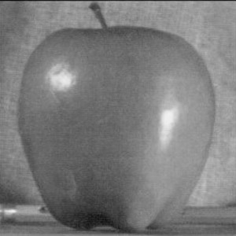

## Multi-resolution Blending

1. **Method Description.** 
   <!-- *TODO*: Describe the key implementation details for blending. -->
    For this problem, I first convert all three images to grayscale. Then I compute the laplacian stack of two input image, by computing image with different gaussian filter and find their difference. Then I computed a gaussian stack, by computing the mask with different gaussian filter. Then I combine these three stacks with the equation given in the paper. Lastly, I stack these images together by simply adding them together and normalize the result.

2. **Oraple.** 
   <!-- *TODO:* Include visualizations of the Oraple blending along any variations your tried (include both original images and the blended image) -->

    

      
      
    

    

      
      
    

3. **Blends of your choice.** 
   <!-- *TODO:* Include visualizations of blends of your choice (include both original images and the blended image). Describe any modifications you made on top of what worked for the oraple. -->
   

      
      
    

    

      
      
    

    I attempted the famous eye on hand image blend. On top of the original oraple blend, I changed the depth of the image stack from 10 to 20 to get a visually pleasing result.