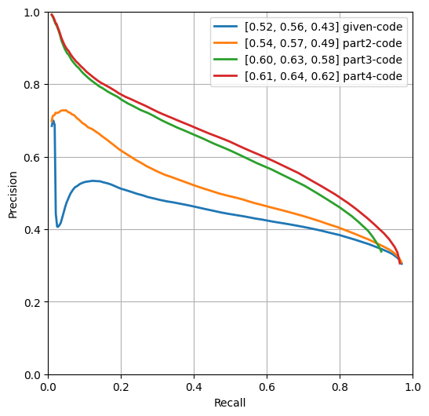
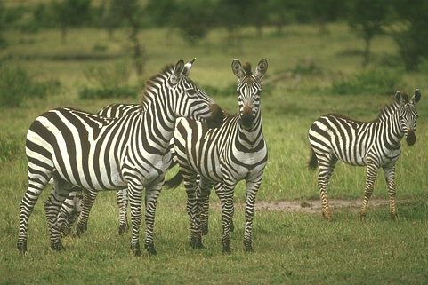

## Contour Detection

1. **Method Description.** 
   
   For part 2 of this question, I tried different boundary condition for the convolve function. Visually speaking, handling the boundary condition with `symm` gives the best result.
   
   For part 3 of this question, I tried 1-D gaussian filters with different width and $\sigma$ value. I also tried to first apply gaussian filter to the image, then apply derivative filter to the image. Base on the output matric, it seems that a wider gaussian filter with a $\sigma$ about $\frac{1}{6}$ of the filter width gives better result. In particular, a 25-pixel wide gaussian filter with $\sigma=4$ gives me the highset overall F1 score.

   For part 4 of this question, I tired to perform 2-pixel interpolation first, then perform non-maximum suppression. I did not try bilinear interpolation, which in theory should give better result.

2. **Precision Recall Plot.** 
   <!-- *TODO*: Use [contour_plot.py](contours/../contour_plot.py) to add curves for the different methods that you implemented into a single plot. -->
   
   

      
   

3. **Results Table.** 

   | Method | overall max F-score | average max F-score | AP | Runtime (seconds) |
   | ----------- | --- | --- | ---  | --- |
   | Initial implementation | 0.52 | 0.56 | 0.43 | 0.0117 |
   | Warm-up   | 0.54 | 0.57 | 0.49 | 0.0123 |
   | Smoothing | 0.60 | 0.63 | 0.58 | 0.0394 |
   | Non-max suppression | 0.61 | 0.64 | 0.62 | 1.4516 |
   | Test set numbers of best model [From gradescope] | 0.61 | 0.64 | 0.62 | 1.53 |

5. **Visualizations.** 
   <!-- *TODO:* Include visualization on 3 images (before and after the contour detection). Comment on
   your observations, where does your contour detector work well, where it doesn't and why? you can are also add visualizations of your own images. -->
   

      
      
   

   

      
      
   

   

      
      
   

   From three set of images above, the edge detector works relatively well when the color contrast is high. When the contrast is realtively low, the gradient is smaller and hence the maximum value is lower, and the edge become dimmer in the image.

<!-- 6. **Bells and Whistles.** *TODO*: Include details of the bells and whistles that you
   tried here.

   *TODO*: Present the performance metrics for the bells and whistles in a table format
   
   | Method | overall max F-score | average max F-score | AP | Runtime (seconds) |
   | ----------- | --- | --- | ---  | --- |
   | Best base Implementation (from above) | | | | 
   | Bells and whistle (1) [extra credit]) | | | | 
   | Bells and whistle (2) [extra credit]) | | | |
   | Bells and whistle (n) [extra credit]) | | | | -->