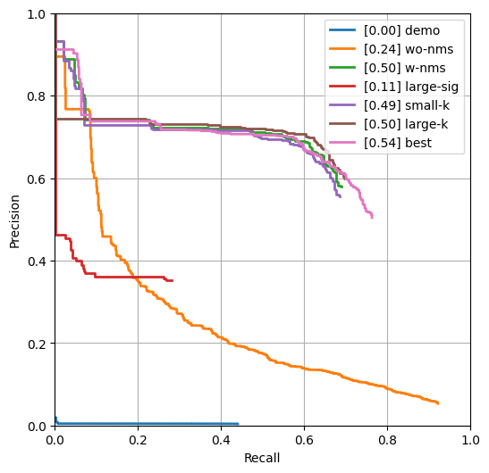

## Corner Detection

<!-- **NOTE:** All values and figures in this template are examples that you will need to replace with your own results -->

1. **Method Description.** 
   <!-- *TODO*: Describe the different mehtods and their key implementation detials. -->

   For this problem, I first convert the image to grayscale image, then I compute the gradient of the image. From the gradient, I can calculate different term in $M$ matrix. For example, for $\sum w(x,y)I_{x}^2$, I first compute the $I_x^2 = d_x^2$, where $d_x$ is the gradient along $x$ axis of the image. Then I convolve this image with a gaussian filter, so the result would be the desired $\sum w(x,y)I_{x}^2$.

   After getting all three terms, I can then calculate the determinent and trance of the matrix $M$. Then I can compute the response with $r=det(M)-k*(trace^2)$, where $k$ is a constant.

   We know from the equation derivation that any $R > 0$ could represent a corner in the image. So I threshold the response image, then use a non-maximum suppression with a certain window size to determine the corner.

2. **Precision Recall Plot.** 

   

      
   

3. **Results Table.** 

   | Method | Average Precision | Runtime |
   | ------ | ----------------- | ------- |
   | Random | 0.001 | 0.001   |
   | Harris w/o NMS | 0.242 | 0.002 |
   | Harris w/ NMS | 0.503 | 0.104 |
   | Larger $\sigma$ & NMS window | 0.107 | 0.102 |
   | Smaller k value | 0.494 | 0.103 |
   | Larger k value | 0.505 | 0.102 |
   | Test set numbers of best model [From gradescope] | 0.542 | 0.110 |

4. **Visualizations.** 
   <!-- *TODO:* Include visualization on 3 images. Comment on -->
   <!-- your observations, where does your corner detector work well, where it doesn't and why? We aslo provided some images in [data/vis](data/vis) for testing, but you are free to use your own images as well. -->
   

      
   

   

      
   

   

      
   

   This algorithm did relatively weill in these three cases. It successfully marked most major corners in the image. However, in the airplane image, it failed to mark the corner in the shadow of the wing.

5. **Bells and Whistles.** 

   I tried different method to calculate the gradient. I compared using `numpy.gradient()`, using simple 3-point derivative along two axis, and using a sobel edge filter. It turns out the best result comes with the simple 3-point derivative filter and a $k=0.5$, $\sigma=0.85$, and NMS window size of 3.

   | Method | Average Precision | Runtime |
   | ------ | ----------------- | ------- |
   | Best base Implementation (from above) | 0.542 | 0.110 |
   | Using simple 3-point derivative | 0.549 | 0.110 |
   | Using sobel filter | 0.480 | 0.112 |